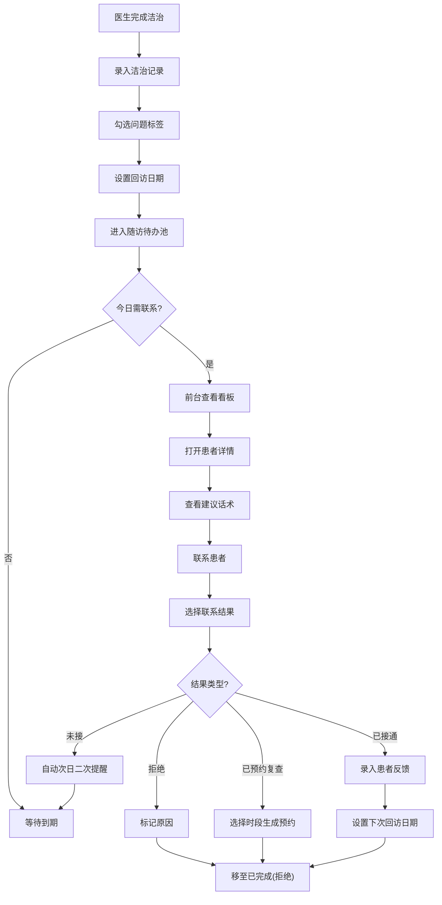

## 1. 产品概述

口腔诊所随访看板是一款面向中小口腔诊所的Web应用，将洁治后患者维护工作从纸质登记升级为数字化每日待办管理，提升随访效率与患者复诊转化率。

- 目标用户：诊所前台人员、洁治医生
- 核心价值：随访责任落实到人，提高患者复诊率，减少遗漏
- 解决痛点：纸质登记易丢失、跟进不及时、无统一话术、结果无法追溯

## 2. 核心功能

### 2.1 用户角色

| 角色 | 登录方式 | 核心权限 |
|------|----------|----------|
| 洁治医生 | 账号密码登录 | 患者档案管理、洁治记录录入、标签勾选、设置回访日期 |
| 前台人员 | 账号密码登录 | 随访看板查看、联系结果记录、复诊预约、患者反馈录入 |
| 诊所管理员 | 账号密码登录 | 账号管理、数据统计、配置管理 |

### 2.2 功能模块

1. **随访看板主页**：三栏式待办看板（今日需联系/逾期未联系/已完成）、快捷搜索、筛选
2. **患者档案页**：患者基本信息、洁治历史记录、标签管理、回访计划
3. **洁治记录录入**：洁治项目、医生交代事项、标签勾选（牙龈出血/牙石较多/牙周袋提示等）、建议回访日期
4. **随访详情卡片**：患者信息概览、本次洁治详情、医生交代、建议话术、联系结果记录
5. **复诊预约模块**：空闲时段选择、预约生成、预约确认
6. **数据统计**：随访完成率、复诊转化率、各医生工作量统计

### 2.3 页面详情

| 页面名称 | 模块名称 | 功能描述 |
|----------|----------|----------|
| 登录页 | 登录表单 | 账号密码登录、角色选择、记住登录状态 |
| 随访看板页 | 三栏看板 | 今日需联系、逾期未联系、已完成分组展示，支持拖拽状态变更 |
| 随访看板页 | 患者卡片 | 显示姓名、性别、年龄、洁治日期、标签、建议回访日期、责任医生 |
| 随访看板页 | 筛选搜索 | 按医生、按标签、按日期范围筛选，姓名/电话搜索 |
| 随访详情弹窗 | 患者信息 | 姓名、电话、年龄、上次洁治时间、历史随访记录 |
| 随访详情弹窗 | 洁治详情 | 洁治项目、医生交代事项、问题标签、建议话术 |
| 随访详情弹窗 | 结果记录 | 联系结果选择（已接通/未接/拒绝/已预约复查）、患者反馈录入、下次回访日期 |
| 随访详情弹窗 | 复诊预约 | 日期选择、时段选择、预约确认、自动关联患者信息 |
| 患者档案页 | 基本信息 | 姓名、性别、年龄、电话、初诊日期、档案编号 |
| 患者档案页 | 洁治记录列表 | 历次洁治记录、标签、回访记录、复诊预约记录 |
| 患者档案页 | 新增洁治记录 | 洁治日期、项目选择、标签勾选、医生交代、建议回访日期 |
| 数据统计页 | 概览卡片 | 本月随访数、完成率、复诊转化率、待联系人数 |
| 数据统计页 | 趋势图表 | 按周/月随访趋势、复诊转化趋势 |
| 数据统计页 | 医生排名 | 各医生洁治数量、随访完成率、复诊转化率排名 |

## 3. 核心流程

### 3.1 洁治后录入流程
医生完成洁治 → 进入患者档案 → 新增洁治记录 → 勾选问题标签（牙龈出血/牙石较多/牙周袋提示） → 填写医生交代事项 → 选择建议回访日期 → 保存后自动进入随访待办

### 3.2 前台随访流程
前台登录 → 查看随访看板 → 点击"今日需联系"中患者卡片 → 查看洁治详情和建议话术 → 电话/微信联系患者 → 选择联系结果 → 录入患者反馈（刷牙出血是否缓解、是否使用牙线等） → 若同意复诊则选择时段预约 → 保存后卡片移至对应分组

### 3.3 二次提醒机制
未接通患者 → 系统自动标记需次日二次提醒 → 次日自动出现在"今日需联系"列表 → 连续多次未接可标记为长期未联系

## 4. 用户界面设计

### 4.1 设计风格
- **主色调**：薄荷绿(#2DD4BF) + 深灰蓝(#1E293B)，体现医疗专业感和清新感
- **辅助色**：珊瑚橙(#FB923C)用于提醒/逾期，天蓝色(#38BDF8)用于预约
- **整体风格**：简洁专业的卡片式设计，圆角卡片，柔和阴影，清晰的信息层级
- **字体**：标题使用思源黑体粗体，正文使用思源黑体常规
- **图标风格**：线性轮廓图标，简洁明了

### 4.2 页面设计概述

| 页面名称 | 模块名称 | UI元素 |
|----------|----------|--------|
| 登录页 | 登录表单 | 左侧品牌展示区（渐变背景+诊所图标），右侧白色登录卡片，圆角输入框，悬浮按钮动效 |
| 随访看板页 | 顶部导航 | 诊所logo、当前角色、日期选择、搜索框、头像下拉菜单 |
| 随访看板页 | 三栏看板 | 每栏顶部显示分组标题和数量，卡片列表支持垂直滚动，卡片悬停上浮效果 |
| 随访看板页 | 患者卡片 | 头像+姓名+基本信息行，标签徽章区域，洁治日期+责任医生，底部操作按钮 |
| 随访详情弹窗 | 弹窗布局 | 左侧患者信息侧栏，右侧详情标签页（洁治详情/随访记录/预约） |
| 随访详情弹窗 | 结果记录区 | 结果按钮组（大按钮选中态），反馈输入框，日期选择器，保存按钮 |
| 患者档案页 | 页面布局 | 顶部患者信息栏 + 左侧导航 + 右侧内容区 |
| 患者档案页 | 洁治记录 | 时间轴样式展示历次记录，标签徽章，点击展开详情 |
| 数据统计页 | 概览卡片 | 四个数据卡片并排，带趋势小箭头和环比变化 |
| 数据统计页 | 图表区域 | 折线图+柱状图组合，支持切换时间维度 |

### 4.3 响应式
- 桌面端优先设计（1440px基准）
- 平板端自适应，三栏变两栏，侧边栏可折叠
- 移动端单栏展示，底部导航切换分组，卡片堆叠布局

### 4.4 交互动效
- 页面加载：卡片错落渐入动画
- 卡片悬停：轻微上浮+阴影加深
- 弹窗打开：缩放+淡入效果
- 状态切换：平滑过渡动画
- 表单提交：按钮loading状态
- 标签徽章：不同颜色区分严重程度
