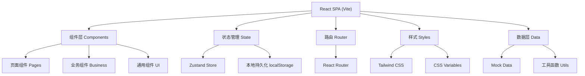
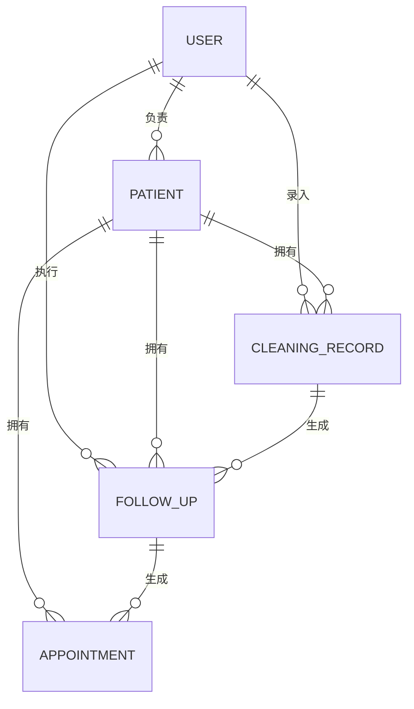

## 1. 架构设计

本项目为纯前端单页应用，使用 React + Vite 构建，数据采用 Mock 方式存储在 localStorage 中模拟后端。



## 2. 技术描述

- **前端框架**: React@18 + TypeScript
- **构建工具**: Vite@5
- **样式方案**: Tailwind CSS@3 + CSS Variables
- **路由管理**: React Router@6
- **状态管理**: Zustand@4
- **图标库**: Lucide React
- **日期处理**: date-fns
- **数据存储**: localStorage (Mock 数据)
- **UI 组件**: 自研轻量级组件库 (基于 Tailwind)

## 3. 目录结构

```
src/
├── assets/          # 静态资源
├── components/      # 组件
│   ├── ui/         # 通用UI组件 (Button, Input, Card, Modal...)
│   ├── layout/     # 布局组件 (Layout, Sidebar, Header...)
│   ├── board/      # 看板相关组件
│   ├── patient/    # 患者相关组件
│   └── common/     # 通用业务组件
├── pages/           # 页面
│   ├── Login.tsx
│   ├── Board.tsx
│   ├── PatientDetail.tsx
│   └── Statistics.tsx
├── store/           # 状态管理
│   ├── usePatientStore.ts
│   ├── useFollowUpStore.ts
│   └── useAuthStore.ts
├── types/           # TypeScript 类型定义
│   ├── patient.ts
│   ├── followUp.ts
│   └── user.ts
├── utils/           # 工具函数
│   ├── date.ts
│   ├── storage.ts
│   └── mock.ts
├── data/            # Mock 数据
│   └── initialData.ts
├── hooks/           # 自定义 Hooks
│   ├── useFollowUp.ts
│   └── usePatient.ts
├── App.tsx
├── main.tsx
└── index.css
```

## 4. 路由定义

| 路由路径 | 页面名称 | 说明 |
|----------|----------|------|
| /login | 登录页 | 账号密码登录 |
| /board | 随访看板 | 三栏式待办看板 (默认首页) |
| /patient/:id | 患者档案 | 患者详情和洁治记录 |
| /patient/new | 新增患者 | 新建患者档案 |
| /statistics | 数据统计 | 随访数据统计报表 |

## 5. 数据模型

### 5.1 实体关系图



### 5.2 数据类型定义

#### User (用户)
```typescript
interface User {
  id: string;
  name: string;
  role: 'doctor' | 'reception' | 'admin';
  avatar?: string;
  phone?: string;
}
```

#### Patient (患者)
```typescript
interface Patient {
  id: string;
  name: string;
  gender: 'male' | 'female';
  age: number;
  phone: string;
  firstVisitDate: string;
  archiveNo: string;
  doctorId: string;
  tags: string[];
  notes?: string;
}
```

#### CleaningRecord (洁治记录)
```typescript
interface CleaningRecord {
  id: string;
  patientId: string;
  doctorId: string;
  date: string;
  items: string[];        // 洁治项目
  problemTags: string[];  // 问题标签
  doctorNotes: string;    // 医生交代事项
  suggestedFollowUpDate: string;
  suggestions?: string;   // 建议话术
}
```

#### FollowUp (随访记录)
```typescript
interface FollowUp {
  id: string;
  patientId: string;
  cleaningRecordId: string;
  assignedDoctorId: string;
  assignedReceptionId?: string;
  plannedDate: string;     // 计划随访日期
  status: 'pending' | 'overdue' | 'completed' | 'cancelled';
  result?: 'connected' | 'noAnswer' | 'refused' | 'booked';
  patientFeedback?: {
    bleedingImproved?: boolean;
    flossUsing?: boolean;
    otherComments?: string;
  };
  nextFollowUpDate?: string;
  notes?: string;
  createdAt: string;
  updatedAt: string;
  attemptCount: number;    // 联系次数
}
```

#### Appointment (预约)
```typescript
interface Appointment {
  id: string;
  patientId: string;
  followUpId?: string;
  doctorId: string;
  date: string;
  timeSlot: string;
  type: string;
  status: 'pending' | 'confirmed' | 'cancelled' | 'completed';
  notes?: string;
  createdAt: string;
}
```

### 5.3 标签定义

| 标签类型 | 标签名称 | 颜色 |
|----------|----------|------|
| 问题标签 | 牙龈出血 | 红色 |
| 问题标签 | 牙石较多 | 橙色 |
| 问题标签 | 牙周袋提示 | 紫色 |
| 问题标签 | 牙渍明显 | 黄色 |
| 问题标签 | 敏感牙齿 | 蓝色 |
| 随访结果 | 已接通 | 绿色 |
| 随访结果 | 未接 | 灰色 |
| 随访结果 | 拒绝 | 红色 |
| 随访结果 | 已预约 | 蓝色 |

## 6. 核心模块设计

### 6.1 随访看板核心逻辑
- 按日期自动计算：今日需联系 (plannedDate = today 且 status = pending)
- 逾期未联系：plannedDate < today 且 status = pending
- 已完成：status = completed / cancelled
- 支持按医生、标签、日期范围筛选
- 未接通自动+1天到次日待办

### 6.2 状态管理
- 使用 Zustand 管理全局状态
- 患者数据、随访数据、预约数据分别独立 store
- 状态变更持久化到 localStorage
- 支持初始化 Mock 数据

### 6.3 组件拆分
- FollowUpBoard: 看板主容器
- FollowUpColumn: 单栏列表
- PatientCard: 患者卡片
- FollowUpDetailModal: 随访详情弹窗
- FollowUpResultForm: 结果录入表单
- AppointmentScheduler: 预约时段选择

## 7. Mock 数据规划

- 5 名医生用户
- 2 名前台用户
- 30+ 名患者
- 50+ 条洁治记录
- 40+ 条随访记录（各种状态分布）
- 10+ 条预约记录
